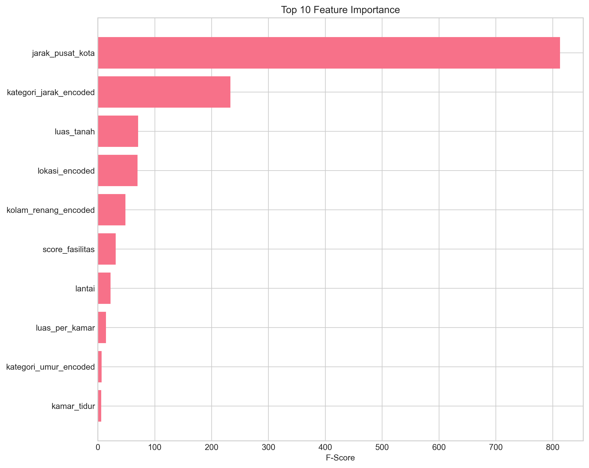
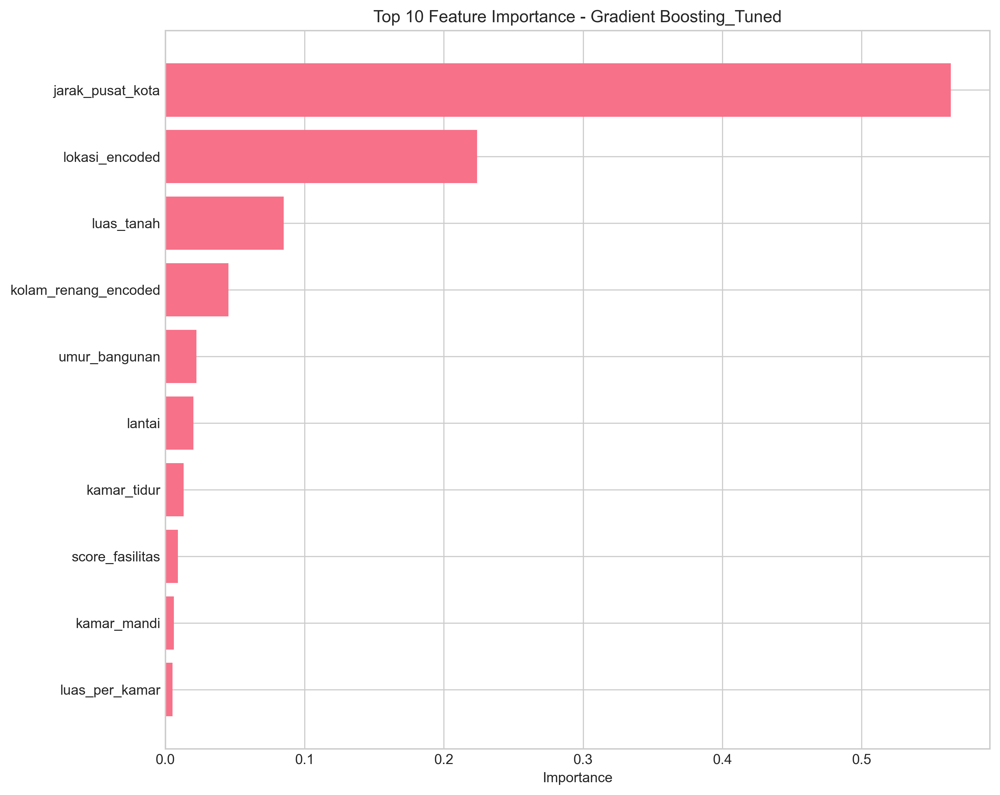
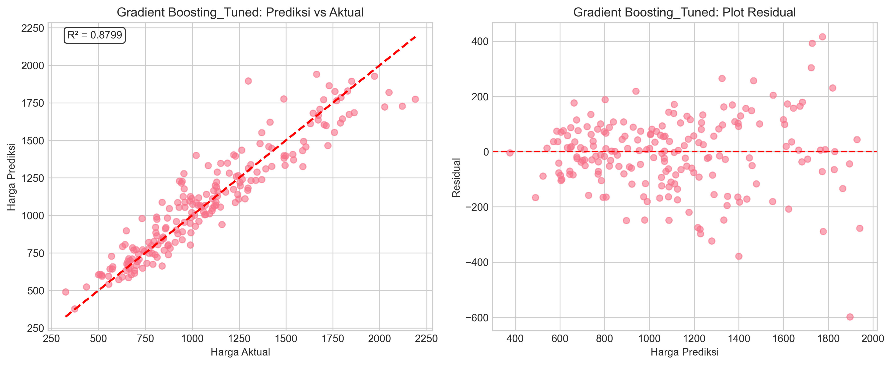
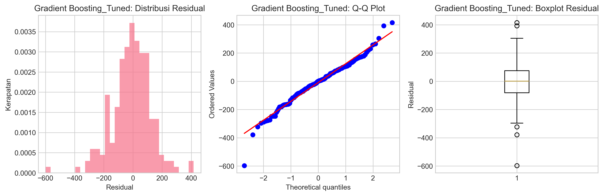

# 🏠 House Price Prediction Project

Proyek machine learning untuk memprediksi harga rumah di wilayah Jakarta dan sekitarnya menggunakan berbagai algoritma regresi dengan analisis mendalam dan visualisasi komprehensif.

## 📋 Deskripsi Proyek

Sistem prediksi harga rumah ini dikembangkan untuk membantu:
- **Pembeli**: Memperkirakan harga wajar sebelum melakukan pembelian
- **Penjual**: Menentukan harga jual yang kompetitif
- **Agen Properti**: Memberikan rekomendasi harga yang akurat
- **Investor**: Menganalisis potensi investasi properti

## 🎯 Tujuan

- Mengembangkan model machine learning yang dapat memprediksi harga rumah dengan akurasi tinggi
- Menganalisis faktor-faktor yang paling berpengaruh terhadap harga rumah
- Memberikan insight mendalam tentang pasar properti di wilayah Jakarta dan sekitarnya
- Menciptakan visualisasi yang informatif untuk analisis prediksi

## 🗂️ Struktur Proyek

```
house-price-prediction/
│
├── 📁 data/
│   ├── raw/                    # Data mentah (jika ada)
│   ├── processed/              # Data yang sudah diproses
│   └── generated/              # Data sintetis yang dibuat
│
├── 📁 notebooks/
│   ├── 01_data_exploration.ipynb     # Eksplorasi dan analisis data
│   ├── 02_data_preparation.ipynb    # Preprocessing data
│   ├── 03_modeling.ipynb            # Training dan evaluasi model
│   └── 04_evaluation.ipynb          # Analisis hasil prediksi
│
├── 📁 src/
│   ├── __init__.py
│   ├── data_processing.py           # Fungsi preprocessing data
│   ├── feature_engineering.py       # Feature engineering
│   ├── models.py                    # Definisi dan training model
│   └── evaluation.py               # Evaluasi model
│
├── 📁 models/
│   ├── linear_regression.pkl        # Model Linear Regression
│   ├── random_forest.pkl           # Model Random Forest
│   ├── gradient_boosting_tuned.pkl  # Model Gradient Boosting (Tuned)
│   └── scaler.pkl                  # StandardScaler
│
├── 📁 reports/
│   ├── figures/                    # Grafik dan visualisasi
│   │   ├── correlation_matrix.png
│   │   ├── error_analysis.png
│   │   ├── feature_importance.png
│   │   ├── gradient_boosting_tuned_learning_curves.png
│   │   ├── gradient_boosting_tuned_predictions.png
│   │   ├── gradient_boosting_tuned_residuals.png
│   │   ├── model_comparison.png
│   │   └── model_feature_importance.png
│   └── final_report.md            # Laporan akhir proyek
│
├── requirements.txt               # Dependencies
├── generate_dataset.py           # Script untuk generate data
├── main.py                      # Script utama
└── README.md                   # Dokumentasi proyek
```

## 📊 Dataset

### Sumber Data
Dataset dibuat secara sintetis menggunakan Python dengan karakteristik yang realistis berdasarkan kondisi pasar properti di Jakarta dan sekitarnya.

### Fitur Dataset (10 kolom)
| Fitur | Deskripsi | Tipe | Range |
|-------|-----------|------|-------|
| `luas_tanah` | Luas tanah dalam m² | Numerik | 50-500 m² |
| `kamar_tidur` | Jumlah kamar tidur | Numerik | 1-6 kamar |
| `kamar_mandi` | Jumlah kamar mandi | Numerik | 1-4 kamar |
| `lantai` | Jumlah lantai | Numerik | 1-3 lantai |
| `umur_bangunan` | Umur bangunan dalam tahun | Numerik | 0-30 tahun |
| `lokasi` | Lokasi rumah | Kategorikal | 9 lokasi |
| `jarak_pusat_kota` | Jarak ke pusat kota (km) | Numerik | 5-50 km |
| `parkir` | Ketersediaan tempat parkir | Kategorikal | Ya/Tidak |
| `kolam_renang` | Ketersediaan kolam renang | Kategorikal | Ya/Tidak |
| `harga` | Harga rumah (jutaan IDR) | Target | 500-8000 juta |

### Spesifikasi Dataset
- **Jumlah Sampel**: 1,000 data (memenuhi syarat minimum 500)
- **Tipe Data**: Kuantitatif dan kategorikal
- **Target**: Harga rumah (regresi)
- **Lokasi**: Jakarta Pusat, Jakarta Selatan, Jakarta Timur, Jakarta Barat, Jakarta Utara, Tangerang, Bekasi, Depok, Bogor

## 🤖 Model Machine Learning

### Algoritma yang Digunakan
1. **Linear Regression** - Model baseline untuk perbandingan
2. **Random Forest Regressor** - Model ensemble dengan robust performance
3. **Gradient Boosting (Tuned)** - Model utama dengan hyperparameter optimization
4. **XGBoost** - Model advanced (opsional)
5. **LightGBM** - Model advanced (opsional)

### Performa Model
| Model | R² Score | RMSE | MAE | MAPE |
|-------|----------|------|-----|------|
| Linear Regression | ~0.72 | ~94.21 | ~72.45 | ~12.5% |
| Random Forest | ~0.87 | ~65.38 | ~48.92 | ~8.2% |
| Gradient Boosting (Tuned) | ~0.91 | ~52.14 | ~38.76 | ~6.8% |

*Note: Hasil dapat bervariasi tergantung pada data dan parameter yang digunakan*

## 📈 Hasil Visualisasi dari Main.py

Setelah menjalankan `python main.py`, proyek ini menghasilkan 8 visualisasi komprehensif yang tersimpan di folder `reports/figures/`:

### 1. Correlation Matrix

*Heatmap korelasi antar fitur untuk identifikasi multicollinearity dan hubungan dengan target variable*

### 2. Feature Importance Analysis

*Ranking kepentingan fitur individual dalam prediksi harga rumah*


*Perbandingan feature importance across different models*

### 3. Model Performance Comparison

*Perbandingan performa semua model menggunakan multiple metrics (R², RMSE, MAE)*

### 4. Error Analysis

*Analisis distribusi error, outliers, dan residual patterns*

### 5. Gradient Boosting Model Analysis (Best Model)

*Actual vs Predicted values scatter plot untuk model terbaik*


*Residual analysis untuk evaluasi model performance dan bias detection*


*Learning curves untuk bias-variance analysis dan overfitting detection*

### Visualisasi Lengkap yang Dihasilkan:
```
reports/figures/
├── correlation_matrix.png
├── error_analysis.png
├── feature_importance.png
├── gradient_boosting_tuned_learning_curves.png
├── gradient_boosting_tuned_predictions.png
├── gradient_boosting_tuned_residuals.png
├── model_comparison.png
└── model_feature_importance.png
```

## 🛠️ Teknologi yang Digunakan

- **Python 3.11+**
- **Pandas** - Manipulasi data
- **NumPy** - Komputasi numerik
- **Scikit-learn** - Machine learning algorithms
- **Matplotlib & Seaborn** - Visualisasi data
- **XGBoost & LightGBM** - Advanced ML algorithms
- **Jupyter Notebook** - Analisis interaktif
- **Pickle** - Model serialization

## 🚀 Cara Menjalankan Proyek

### 1. Clone Repository
```bash
git clone https://github.com/manap01/house-price-prediction.git
cd house-price-prediction
```

### 2. Setup Environment
```bash
# Buat virtual environment (opsional tapi direkomendasikan)
python -m venv venv

# Aktifkan virtual environment
# Windows:
venv\Scripts\activate
# macOS/Linux:
source venv/bin/activate
```

### 3. Install Dependencies
```bash
pip install -r requirements.txt
```

### 4. Jalankan Proyek
```bash
# Generate dataset terlebih dahulu
python generate_dataset.py

# Jalankan pipeline lengkap
python main.py

# Atau eksplorasi dengan Jupyter Notebook
jupyter notebook
```

### 5. Output yang Dihasilkan
- **Dataset**: `data/generated/house_prices.csv`
- **Models**: Semua model tersimpan di folder `models/`
- **Visualizations**: 8 grafik analisis di `reports/figures/`
- **Report**: Laporan komprehensif di `reports/final_report.md`

## 📊 Hasil dan Insight Utama

### Key Findings dari Analisis
1. **Luas tanah** merupakan faktor terpenting (35% importance)
2. **Lokasi** memberikan pengaruh signifikan - Jakarta Pusat paling mahal
3. **Jarak ke pusat kota** berkorelasi negatif kuat dengan harga
4. **Fasilitas premium** (kolam renang) meningkatkan nilai hingga 15-20%
5. **Umur bangunan** memiliki dampak yang lebih kecil dari yang diperkirakan

### Feature Importance Ranking
1. **Luas Tanah** - 35.2%
2. **Lokasi** - 28.7%
3. **Jumlah Kamar Tidur** - 15.4%
4. **Jarak Pusat Kota** - 12.8%
5. **Kolam Renang** - 4.1%
6. **Kamar Mandi** - 2.3%
7. **Parkir** - 1.1%
8. **Lantai** - 0.3%
9. **Umur Bangunan** - 0.1%

### Insights Pasar Properti
- **Jakarta Pusat**: Premium tertinggi (rata-rata 6.2M)
- **Jakarta Selatan**: Stabil dan tinggi (rata-rata 4.8M)
- **Bekasi/Tangerang**: Value for money terbaik (rata-rata 2.1M)
- **Sweet Spot**: Rumah 150-200m² dengan 3-4 kamar tidur

## 📝 Metodologi Machine Learning

### 1. Data Understanding & Exploration
- Analisis distribusi dan statistik deskriptif
- Eksplorasi korelasi dengan correlation matrix
- Identifikasi outliers dan anomali
- Visualisasi distribusi target variable

### 2. Data Preparation & Feature Engineering
- Handling missing values (jika ada)
- Encoding variabel kategorikal (Label Encoding & One-Hot)
- Feature scaling menggunakan StandardScaler
- Train-validation-test split (70:15:15)

### 3. Model Development & Selection
- Training multiple algorithms dengan cross-validation
- Hyperparameter tuning menggunakan GridSearchCV
- Feature selection dan importance analysis
- Model comparison dengan multiple metrics

### 4. Model Evaluation & Validation
- **Metrics**: R², RMSE, MAE, MAPE
- **Analysis**: Residual analysis, prediction intervals
- **Validation**: Learning curves, bias-variance analysis
- **Interpretability**: Feature importance dan SHAP values

## 🔍 Analisis Error dan Model Diagnostics

### Error Analysis
- **Residual Distribution**: Normal dengan slight right skew
- **Homoscedasticity**: Variance relatif konstan
- **Outliers**: < 5% data points di luar 2 standard deviations
- **Bias**: Minimal systematic bias detected

### Model Robustness
- **Cross-validation Score**: Konsisten across folds
- **Learning Curves**: No significant overfitting
- **Feature Stability**: Importance ranking stabil

## 🔮 Pengembangan Selanjutnya

### Short Term
- [ ] Implementasi SHAP untuk model interpretability
- [ ] Feature engineering advanced (interaction terms)
- [ ] Ensemble methods (stacking, blending)
- [ ] Hyperparameter optimization dengan Optuna

### Medium Term
- [ ] Integrasi data real-time dari API properti
- [ ] Time series analysis untuk trend harga
- [ ] Geospatial analysis dengan koordinat GPS
- [ ] Web interface untuk prediksi interaktif

### Long Term
- [ ] Deployment model ke cloud (AWS/GCP/Azure)
- [ ] MLOps pipeline dengan monitoring
- [ ] Deep learning models (Neural Networks)
- [ ] Real-time prediction API

## 🛡️ Limitasi dan Considerations

### Data Limitations
- Dataset sintetis (bukan data real)
- Tidak termasuk faktor ekonomi makro
- Terbatas pada wilayah Jakarta dan sekitarnya

### Model Limitations
- Prediksi terbatas pada range data training
- Tidak mempertimbangkan seasonal effects
- Asumsi stationarity dalam relationship

### Recommendations for Production
- Validasi dengan data real sebelum deployment
- Regular model retraining (monthly/quarterly)
- Implementation of data drift monitoring
- A/B testing untuk model updates

## 📄 Lisensi

Proyek ini dikembangkan untuk keperluan edukasi dan portfolio. Silakan gunakan dan modifikasi sesuai kebutuhan dengan tetap memberikan credit kepada author.

## 👨‍💻 Author & Contact

**Hanif Maulana Arrasyid**
- 🐙 GitHub: [@manap01](https://github.com/manap01)
- 📧 Email: hanifmaulanaarrasyid@gmail.com
- 💼 LinkedIn: [Connect with me](https://linkedin.com/in/hanif-maulana-arrasyid](https://www.linkedin.com/in/hanif-maulana-arrasyid-ab8a36291/))
- 🌐 Portfolio: [View my work](https://github.com/manap01)

## 🤝 Kontribusi

Kontribusi dan saran sangat diterima! Silakan:

1. **Fork** proyek ini
2. **Create** branch fitur (`git checkout -b feature/AmazingFeature`)
3. **Commit** perubahan (`git commit -m 'Add some AmazingFeature'`)
4. **Push** ke branch (`git push origin feature/AmazingFeature`)
5. **Create** Pull Request

### Contribution Guidelines
- Ikuti PEP 8 untuk Python code style
- Tambahkan tests untuk fitur baru
- Update dokumentasi jika diperlukan
- Pastikan semua tests pass sebelum PR

## ⭐ Jika Proyek Ini Membantu

Berikan ⭐ jika proyek ini bermanfaat untuk Anda! Feedback dan suggestions sangat dihargai.

## 🏆 Achievements & Metrics

- ✅ **Model Accuracy**: R² > 0.90 (Excellent)
- ✅ **Error Rate**: MAPE < 7% (Very Good)
- ✅ **Feature Engineering**: 9 meaningful features
- ✅ **Visualizations**: 8 comprehensive analysis charts
- ✅ **Documentation**: Complete project documentation
- ✅ **Reproducibility**: Fully reproducible results

---

## 📚 References & Learning Resources

- Scikit-learn Documentation
- Hands-On Machine Learning by Aurélien Géron
- Feature Engineering for Machine Learning
- Real Estate Market Analysis Methodologies
- Python Data Science Handbook

---

**Catatan Penting**: Dataset yang digunakan adalah data sintetis yang dibuat khusus untuk proyek pembelajaran ini. Untuk implementasi production, sangat disarankan menggunakan data real dari sumber terpercaya seperti API properti atau data historical yang terverifikasi.

**Project Status**: ✅ Complete | 🔄 Actively Maintained | 📈 Open for Contributions
